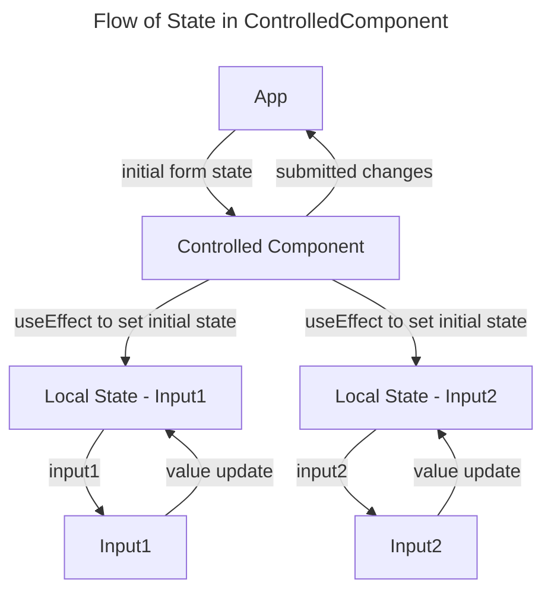
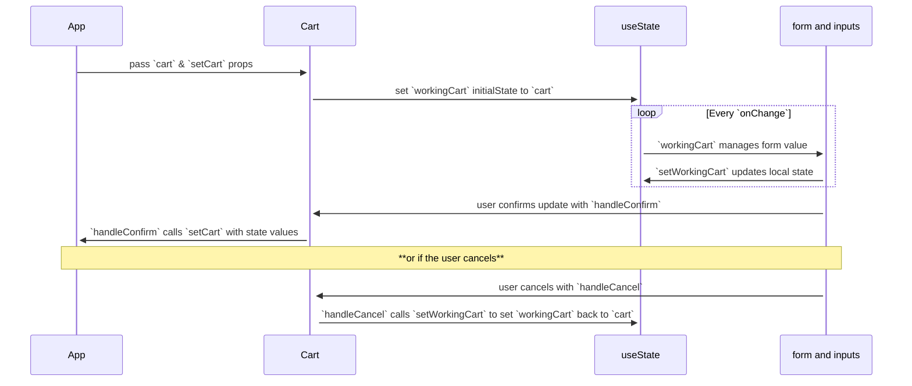

# # Discussion Topics

## Overview

No overview provided

## Learning Objectives

Learning objectives will be defined as the lesson progresses.

## Topics Covered

Topics will be covered as the lesson progresses.

## Status

pending

## Assignment

Assignment for Lesson 5

### Objective

No objective specified

### Expected Capabilities

Expected capabilities will be defined as the lesson progresses.

### Instructions

Instructions will be provided when the lesson is generated.

### Tasks

#### Task 1: Task 1

## Weekly Assignment Instructions

## Expected App Capabilities

After completing this week's assignment, your app should:

- conditionally render a message when the todo list is empty
- disable the Add Todo button when the input is empty
- allow users to complete a todo
- utilize a controlled form

## Instructions Part 1: Conditional Rendering a Message

In TodoList.jsx:

- create a [ternary statement](https://developer.mozilla.org/en-US/docs/Web/JavaScript/Reference/Operators/Conditional_operator) that compares the todoList's length to zero.
  - if `true`, render a paragraph tag that includes the text "Add todo above to get started"
  - if `false`, render the unordered list includes the mapped todo list.

Your app should show the paragraph if the list is empty or the todos if the `todoList` contains any.


## Instructions Part 2: Mark Todo as Complete

Rather than deleting a todo item outright, we want to indicate it has been completed. We'll update the schema that the todos use and create a helper function that toggles the value when the user clicks a checkbox on the todo.

- In `App`, update `newTodo` in the `addTodo` event handler with a new property called `isCompleted` and set it to `false`. Each todo should now consist of 3 properties: `title`, `id`, and `isCompleted`.
- Create a helper function `completeTodo`. It:
  - takes an `id`
  - maps through the `todoList` and:
  - if the current `todo.id` matches the `id`, return a new object that destructures the current todo and `isCompleted` set to `true`
  - otherwise (if `todo.id` does not match the `id`) return the `todo`
  - saves the resulting array to a const `updatedTodos`
  - update the `todoList` state with `updatedTodos`

the function will use logic very similar to the example below:

```js
function favoriteColor(colorId) {
    const updatedColors = colors.map((color) => {
        if (color.id === colorId) {
        return { ...color, isFavorite: true };
    }
        return color;
    });
    //update `colors` state with `updatedColors`
}
```

- pass your new helper function to a `TodoList` props named `onCompleteTodo`
- in `TodoList`, destructure that out of the component's props.
- add the same props to the `TodoListItem` instance and pass in that helper.
- in `TodoListItem`
  - destructure the function out of props
  - create a form element in the list item and move `{todo.title}` into it.
  - above that, create an input
    - give it the type of "checkbox"
    - add the prop `checked` and set it equal to `todo.isCompleted`
    - add an `onChange` event listener and then invoke an anonymous function that returns the helper function with the `todo` object's id.

> [!remember]
> You do not want to call the helper function directly in an event listener props. If you do this, the function will immediately fire off when the component renders, causing bugs!

To assist with the structure of the components elements, follow this layout:

```jsx
{/*extract from TodoListItem.jsx*/}
function TodoListItem({ todo, onCompleteTodo }) {
  return (
    <li>
      <form>
        <input
          {/* set the `type` prop to "checkbox" */}
          {/* add the `checked` props */}
          {/* add `onChange` event listener that uses the `onCompleteTodo` helper` */}
        />
        {todo.title}
      </form>
    </li>
  );
}

export default TodoListItem;
```

Each todo should now have a checkbox. When the checkbox is clicked, the helper function will set `isCompleted` to `true`. Our final step is to filter out the completed todos.

In `TodoList`, we need to filter out the completed todos before we map the todos to `TodoListItem` instances.

- create a constant `filteredTodoList` that contains the `todoList` that has been filtered to remove any todo whose `.isCompleted` property is `true`
- replace the `todoList` references in the JSX with the `filteredTodoList`

Now, when a user clicks on the checkbox beside an item, that todo disappears from the list.


## Instructions Part 3: Convert Form to Controlled Component

### Create Local State

- import `useState` into `TodoForm`
- create a `workingTodoTitle` state variable with the accompanying state update function.
- give the `useState` an initial value of an empty string.

### Connect Form Input to Component State

- to the `input` element in the form, add a `value` props set to `workingTodoTitle`.
- add an `onChange` listener to the `input`.
  - it should call an anonymous arrow function that takes in the event object.
  - the anonymous function should call `setWorkingTodo` and pass in the event's target value.

### Update `handleAddTodo`

- remove the lines that access the title's value from the event object
  - hint: there's one that retrieves the value and one that sets the target's title `value` back to `""`
- update `onAddTodo` so that it gets passed `workingTodoTitle` instead of `title`.
- after `onAddTodo`, call the `setWorkingTodo` state update function with an empty string to reset the form input.

## Instructions Part 4: Disable Form Button when Input is Empty

We are pretty close to being complete for this week but there is one minor problem with the interface. A user is able to add empty todos to their list. Since the form was converted to a controlled component, we can do so based on the value of the working state in the component.


- In `TodoForm`'s button element, add a `disabled` prop that evaluates to true when `workingTodo` is an empty string.


```

```

### Submission Instructions

Please submit on time

### Checklist

Checklist will be provided when the lesson is generated.

### Check for Understanding

Understanding checks will be provided when the lesson is generated.

## Subsections

### # Discussion Topics

## Discussion Topics

### Conditional Rendering

When we left off with CTD Swag, we had a shopping cart icon and a counter on the upper-right portion of the screen. This gave the user a count of their cart contents but left them without the means to see everything they've selected. A detailed shopping cart takes up a lot of screen real estate and gets in the way of the shopping experience. Components like these are commonly developed so they can be toggled open or closed by some user action.

Conditional rendering allows us to develop an interface that adapts to different states, user interactions, or data inputs. Developers can employ different techniques to hide and show elements, change styles, and update visual content to create interactive and personalized user interfaces. Before we create a shopping cart that we can show/hide, let's look some common techniques we can employ.

#### Ternary Operator

`condition? expressionIfTrue : expressionIfFalse`.

The ternary operator is a useful tool that evaluates a condition and then executes one of two possible expressions. If true, the expression on the left executes. False causes the right-hand expression to execute. These expressions can be written in JSX which results in compact code.

```jsx
//ternary operator that shows 1 of 2 components
const [isTruthy, setIsTruthy] = useState(true);
return(
 <>
  {isTruthy ? <TrueComponent /> : <FalseComponent /> }
  <button type="button" onClick=(()=> setIstTruthy(!isTruthy))>Toggle Value</button>
 </>
);
```

React allows us to use `null` in place of an expression so we can show or hide an element.

```jsx
//ternary operator to conditionally show a component
const [isRendered, setIsRendered] = useState(true);
return(
 <>
  {isTruthy ? <SpecialComponent /> : null }
  <button type="button" onClick=(()=> setIsRendered(!isRendered))>Show/Hide Element</button>
 </>
);
```

#### Logical && Operator

We can take advantage of the way JavaScripts logical `&&` operator works to show or hide an element. Remember that JavaScript evaluates the left side (operand) first before continuing onto the right hand side. When the first operand is truthy, the second operand is evaluated - that is where we return our element. If that first operand is false, JavaScript stops the entire evaluation which prevents the item from being rendered.

```jsx
//logical && operator to conditionally show a component
const [isRendered, setIsRendered] = useState(true);
return(
 <>
  {isTruthy && <SpecialComponent /> }
  <button type="button" onClick=(()=> setIsRendered(!isRendered))>Show/Hide Element</button>
 </>
);
```

#### Display Logic in a Function

In cases where we have more than two options or our rendering logic is complex, we can define functions inside the component and use their return values. What's nice about this approach is that we can return JSX. We'll talk about some performance implications in [[Code The Dream/Intro to React V3/Curriculum/Week-09|Week-09]] that may arise from functions inside components but we will not be writing anything that will cause any performance problems during this course.

In the example below, the interface renders a button that calls `cycleLight`. Each time it does, it cycles through traffic light colors (green->yellow->red->green->…and so on). Each time `trafficLightColor` is updated, the component is re-rendered, calling `renderLight`. `renderLight` uses a switch-case statement to determine the correct component to render.

```jsx
const [trafficLightColor, setTrafficLightColor] = useState('green');

function cycleLight() {
  switch (trafficLightColor) {
    case 'green':
      setTrafficLightColor('yellow');
      return;
    case 'yellow':
      setTrafficLightColor('red');
      return;
    default:
      setTrafficLightColor('green');
      return;
  }
}

function renderLight() {
  switch (trafficLightColor) {
    case 'green':
      return <YellowLight />;
    case 'yellow':
      return <RedLight />;
    default:
      return <GreenLight />;
  }
}

return (
  <>
    {renderLight()}
    <button type="button" onClick={cycleLight}>
      Cycle Light
    </button>
  </>
);
```

#### Putting Conditional Rendering into Action

> [!tip]
> When we need to see dynamic elements in our layout but are not ready to code them, we can add placeholders in the JSX. These can be plain text substitutions for values like a cart's total price or placeholder images similar to the one found on each product's card. This helps us determine our layout and anticipate any tasks that we are going to have to complete. As we continue to build the feature we can replace these substitutions with live code.

##### Combining `baseItems`

Now that we know how to show and hide components, we can start making improvements to the store. The first task is to update cards to let users choose from product variations. This will allow us to combine items of different colors or models into a single card that the user opens to select which variant they want to add to their cart.

To achieve this, we have to change the way ProductList handles inventory items. Rather than mapping them to a `ProductCard` component, we make state variable, `products`, that is updated when `inventory` props changes. Inside this `useEffect` we create an empty array containing `workingProducts` and then iterate over the inventory to compose the each product in `workingProducts` before using that array to set the `products` variable.

`forEach` basically looks at each item's `baseName` property to see if it matches any object already in `workingProducts`. If a match is found, that item is pushed into a `variants` array. If there is no match, a new object is composed for a product and then pushed into `workingProducts`.

```jsx
//extract from ProductList.jsx
//...component code
const [products, setProducts] = useState([]);

useEffect(() => {
  const workingProducts = [];
  inventory.forEach((item) => {
    if (!item.inStock) {
      return;
    }
    if (
      !workingProducts.find(
        (productItem) => productItem.baseName === item.baseName,
      )
    ) {
      workingProducts.push({
        baseName: item.baseName,
        price: item.price,
        baseDescription: item.baseDescription,
        variants: [{ ...item }],
      });
    } else {
      const index = workingProducts.findIndex(
        (productItem) => productItem.baseName === item.baseName,
      );
      workingProducts[index].variants.push({ ...item });
    }
  });
  setProducts([...workingProducts]);
}, [inventory]);
//component code...
```

Our next step is to make changes to the `ProductCard` component so it can conditionally show a "Show Options" button instead of "Add to Cart" when a card contains more than one product variant. We can do so by examining the `variants` length. Our handleAddItemToCart is also updated to grab the id off of the default variant when only one exists.

```jsx
//extract from ProductCard.jsx
<div className="productButtons">
  {product.variants.length > 1 ? (
    <button>Show Options</button>
  ) : (
    <button onClick={() => handleAddItemToCart(product.variants[0].id)}>
      Add to Cart
    </button>
  )}
</div>
```

Finally, we need to display the variants to the user so they can add them to their cart. For this, we create another component, `ProductCardVariants` that accepts an array of variants, a handler function to close the display, and a handler function to add an item to the cart.

```jsx
//ProductCardVariants.jsx

function ProductCardVariants({ variants, closeVariants, handleAddItemToCart }) {
  return (
    <div className="productVariantsWrapper">
      <ul>
        {variants.map((variant) => {
          return (
            <li key={variant.id} className="productVariant">
              <div className="variantPreview">
                
                <p>${variant.price}</p>
              </div>
              <div className="variantDetails">
                <h3>{variant.variantName}</h3>
                <p>{variant.variantDescription}</p>
                <button
                  onClick={() => {
                    handleAddItemToCart(variant.id);
                    closeVariants();
                  }}>
                  Add to cart
                </button>
              </div>
            </li>
          );
        })}
      </ul>
      <button
        className="variantsCloseButton"
        type="button"
        onClick={closeVariants}>
        Close
      </button>
    </div>
  );
}

export default ProductCardVariants;
```

That component is imported into ProductCard, and its visibility will depend on a state variable `areVariantsShown` the accompanying state variable updater function is then used to show/hide the options.

```jsx
//ProductCard.jsx extract

return (
  <li className="productCard">
    <div className="productPreview">
      
    </div>
    <div className="productCopy">
      <h2>{product.baseName}</h2>
      <p>{product.baseDescription}</p>
    </div>
    <div className="productButtons">
      {product.variants.length > 1 ? (
        <button onClick={() => setAreVariantsShown(true)}>Show Options</button>
      ) : (
        <button onClick={() => handleAddItemToCart(product.variants[0].id)}>
          Add to Cart
        </button>
      )}
    </div>
    {areVariantsShown && (
      <ProductCardVariants
        handleAddItemToCart={handleAddItemToCart}
        variants={product.variants}
        closeVariants={() => setAreVariantsShown(false)}
      />
    )}
  </li>
);
```

Here is the resulting change:


##### Create Cart Component

Looking back at CTD swag, we can now determine which approaches to use that best suites our needs at each step of building out the feature.

To get started, we create a cart component which contains the contents of the shopping cart, a cart total, and a button to close the cart. We need to include props for the cart and the handler function that handles closing the cart. The inside an unordered list, items are mapped to `li.cartListItem` similar to how the products were mapped to a list of cards in the store. We can then include a cart total and a button to close the cart. We pass an `onClick` props to the button with the handler function.

```jsx
//Cart.jsx

import placeholder from './assets/placeholder.png';

// `handleCloseCart` is not made yet but we know we will need it
function Cart({ cart, handleCloseCart }) {
  return (
    <>
      <div className="cartScreen"></div>
      {/*
   .cartScreen covers the product list with
   a div that has a blur effect placed on it.
   this makes the product buttons unclickable
  */}
      <div className="cartListWrapper">
        <ul className="cartList">
          {cart.map((item) => {
            return (
              <li className="cartListItem" key={item.cartItemId}>
                
                <h2>{item.baseName}</h2>
                <div className="cartListItemSubtotal">
                  <p>${item.price}</p>
                </div>
              </li>
            );
          })}
        </ul>
        {/* cart total will need to be calculated */}
        <h2>Cart Total: $0.00</h2>
        <button onClick={handleCloseCart}>CloseCart</button>
      </div>
    </>
  );
}

export default Cart;
```

#### Track Cart's Display Status

We next move to the `App` component to add the `Cart` component to the UI. The logic to show and hide the cart is simple so we do not need to extract a function to perform our conditional rendering. We are left with ternary operator or the logical `&&`. Both choices are valid but implementing the feature with the logic `&&` operator will give us with the least amount of code. Let's insert the toggle-able cart underneath the `ProductList` component.

We need a boolean state value that starts out with a value that hides the cart when the SPA is first visited. `const [isCartOpen, setIsCartOpen] = useState(false);` We then conditionally render the `Cart` based on `isCartOpen`. The code below provides the `App`'s full return statement:

```jsx
// App.jsx excerpt

return (
  <>
    <Header cart={cart} handleOpenCart={handleOpenCart} />
    <main>
      <ProductList
        inventory={inventory}
        handleAddItemToCart={handleAddItemToCart}></ProductList>
      {/*`isCartOpen has to be true for the cart to be rendered*/}
      {isCartOpen && <Cart cart={cart} />}
    </main>
    <footer>
      <p>
        Made with ❤️ | &copy; {year.current}{' '}
        <a href="https://codethedream.org/">CTD </a>
      </p>
    </footer>
  </>
);
```

Let's open the React dev tools to see how things are working. We don't have our button wired up yet but we should be able to modify that state value to show/hide the cart.


#### Opening and Closing Cart

The cart is working so now it's time to make handlers to open and close the cart.

```jsx
//App.jsx
//component code...
function handleCloseCart() {
  //prevents re-render if unchanged
  if (isCartOpen) {
    setIsCartOpen(false);
  }
}

function handleOpenCart() {
  //prevents re-render if unchanged
  if (!isCartOpen) {
    setIsCartOpen(true);
  }
}
//component code...
```

We then need to add the props for the handler function into the component definition of the `Header`. When that's been added, we go back to `App` and pass the props into the `Header` `<Header cart={cart} handleOpenCart={handleOpenCart} />`. We complete the handling for opening of the cart by wrapping the image with a button element and then adding in an `onClick` props with the handler function. We also can remove the `useEffect` since it was just to log the cart contents to the console. The `Header`'s code will now look like this:

```jsx
//Header.jsx
import { useEffect } from 'react';
import ctdLogo from './assets/icons/mono-blue-logo.svg';
import shoppingCart from './assets/icons/shoppingCart.svg';

function Header({ cart, handleOpenCart }) {
  return (
    <header>
      <div className="siteBranding">
        
        <h1>CTD Swag</h1>
      </div>
      <div className="shoppingCart">
        <button type="button" onClick={handleOpenCart}>
          
          <p className="cartCount">{cart.length}</p>
        </button>
      </div>
    </header>
  );
}

export default Header;
```

Since we already have the `handleCartClose` in the props of the `Cart` component, it's now a matter of passing the handler as props: `{isCartOpen && <Cart cart={cart} handleCloseCart={handleCloseCart} />}`.


#### Render a Message Instead of an Empty List

It may also be nicer for the user to see a message rather than rendering an empty list. Showing a message or a list is another conditional rendering scenario to address. The logic to change between the two elements is still simple enough that we don't need to extract a function for conditional rendering. The `&&` operator will not work here either so we are left with using a ternary. We look at the `cart`'s length and then determine if it's empty or not. If `cart.length === 0` then the lefthand expression executes, showing the message. If it contain items, the righthand executes, showing the list.

```jsx
// extract from Cart.jsx
//...component code
{
  cart.length === 0 ? (
    <p>cart is empty</p>
  ) : (
    <ul className="cartList">
      {cart.map((item) => {
        return (
          <li className="cartListItem" key="{item.cartItemId}">
            
            <h2>{item.baseName}</h2>
            <div className="cartListItemSubtotal">
              <p>${item.price}</p>
            </div>
          </li>
        );
      })}
    </ul>
  );
}
//component code...
```

We are left with updating the cart total. It's not important to hide this total from the user so we'll add the cart total after the ternary block that shows the list or the empty cart message. To calculate the total, we iterate over the `cart` items to add up the price. Since the logic to do this is a little more complicated, we create a function to return the cart total for display.

```jsx
//extract from Cart.jsx

function Cart({ cart, handleCloseCart }) {
  function getCartPrice() {
    // using `.toFixed` because floating point arithmetic
    // introduces suprising rounding issues
    // eg: `console.log(.99 + .99 +.99)` will print 2.9699999999999998
    return cart.reduce((acc, item) => acc + item.price, 0).toFixed(2);
  }
  return (
    <div className="cartListWrapper">
      //...component code
      <h2>Cart Total: ${getCartPrice()}</h2>
      <button onClick={handleCloseCart}>CloseCart</button>
    </div>
  );
}

export default Cart;
```

#### Updating Cart to Accept User Inputs

Our shopping cart looks pretty good but there are a few improvements that can be made. In shopping carts on other sites frequently users to make changes to their carts - they can remove items or change the quantity of items in the cart.


Currently, the state value, `cart`, is just an array that lists the cart's contents. We want to update `cart` so it creates only one list item for each unique product. The product, in turn, contains data about how many times it's been added to the cart using `itemCount`. We can remove `cartItemId` property and then resume using the item's id as a key in the cart's list. An example cart item now looks like:

```js
//typical `cart` item
{
  "baseName": "Mouse Pad",
  "variantName": "Default"
  "id": "6",
  "price": 12.99,
  "baseDescription": "A pad perfect for mousing",
  "variantDescription": "",
  "image": "mouse-pad.png",
  "inStock": "TRUE",
  "itemCount": 3
}
```

We then need to update the handler that adds item to `cart`. After doing some error handling on `inventoryItem` we search the `cart` for an item that includes the product id. If one exists, the handler needs to increment `itemCount`. If not, it creates a new item to add to the `cart`.

```jsx
//extract from App.jsx

function handleAddItemToCart(id) {
  const inventoryItem = inventory.find((item) => item.id === id);
  if (!inventoryItem) {
    console.error('cart error: item not found');
    return;
  }
  const itemToUpdate = cart.find((item) => item.id === id);
  let updatedCartItem;
  if (itemToUpdate) {
    updatedCartItem = {
      ...itemToUpdate,
      itemCount: itemToUpdate.itemCount + 1,
    };
  } else {
    updatedCartItem = { ...inventoryItem, itemCount: 1 };
  }
  setCart([...cart.filter((item) => item.id !== id), updatedCartItem]);
}
```

We need to update the logic that provides the cart icon its number. Rather than retrieving the cart's length, we have to add together all of the item's `itemCount`s. We extract this to a function since `.reduce`would make the JSX difficult to read if we inline it between the paragraph tags.

```jsx
//Header.jsx

import ctdLogo from './assets/icons/mono-blue-logo.svg';
import shoppingCart from './assets/icons/shoppingCart.svg';

function Header({ cart, handleOpenCart }) {
  function getItemCount() {
    return cart.reduce((acc, item) => acc + item.itemCount, 0);
  }

  return (
    <header>
      <div className="siteBranding">
        
        <h1>CTD Swag</h1>
      </div>
      <div className="shoppingCart">
        <button type="button" onClick={handleOpenCart}>
          
          <p className="cartCount">{getItemCount()}</p>
        </button>
      </div>
    </header>
  );
}

export default Header;
```

We can then update `Cart` component's JSX to reflect the changes we've made. We replace the item price with an item count and a price sub-total. The cart's total also needs to be recalculated.

```jsx
//Cart.jsx
import placeholder from './assets/placeholder.png';

function Cart({ cart, handleCloseCart }) {
  function getCartPrice() {
    return cart
      .reduce((acc, item) => acc + item.price * item.itemCount, 0)
      .toFixed(2);
  }

  return (
    <>
      <div className="cartScreen"></div>
      <div className="cartListWrapper">
        {cart.length === 0 ? (
          <p>cart is empty</p>
        ) : (
          <ul className="cartList">
            {cart.map((item) => {
              return (
                <li className="cartListItem" key={item.id}>
                  
                  <h2>{item.baseName}</h2>
                  {item.variantName !== 'Default' ? (
                    <p>{item.variantName}</p>
                  ) : null}
                  <div className="cartListItemSubtotal">
                    <p>Count: {item.itemCount}</p>
                    <p>Subtotal: ${(item.price * item.itemCount).toFixed(2)}</p>
                  </div>
                </li>
              );
            })}
          </ul>
        )}
        <h2>Cart Total: ${getCartPrice()}</h2>
        <button onClick={handleCloseCart}>CloseCart</button>
      </div>
    </>
  );
}

export default Cart;
```

With the cart ready, we can make its data updatable for users.


### Controlled Components

React controlled components are form elements where the component state is controlled by React. The component state is updated through user interactions like typing into input fields or selecting options in drop-downs. This ensures that React has full control over the input values and allows for dynamic updates and validation. Controlled components provide a single source of truth for the data, making it easier to manage and synchronize with other components in the application.

To get started with controlled components, we will compare an uncontrolled form with a controlled form.

```jsx
import React, { useRef } from 'react';

const UncontrolledForm = () => {
  const firstNameRef = useRef();
  const lastNameRef = useRef();

  const handleSubmit = (event) => {
    event.preventDefault();
    const firstName = firstNameRef.current.value;
    const lastName = lastNameRef.current.value;
    console.log(`First Name: ${firstName}, Last Name: ${lastName}`);
  };

  return (
    <form onSubmit={handleSubmit}>
      <label>
        First Name:
        <input type="text" ref={firstNameRef} />
      </label>
      <label>
        Last Name:
        <input type="text" ref={lastNameRef} />
      </label>
      <button type="submit">Submit</button>
    </form>
  );
};

export default UncontrolledForm;
```

```jsx
import React, { useState } from 'react';

const ControlledForm = () => {
  const [firstName, setFirstName] = useState('');
  const [lastName, setLastName] = useState('');

  const handleSubmit = (event) => {
    event.preventDefault();
    console.log(`First Name: ${firstName}, Last Name: ${lastName}`);
  };

  return (
    <form onSubmit={handleSubmit}>
      <label>
        First Name:
        <input
          type="text"
          value={firstName}
          onChange={(e) => setFirstName(e.target.value)}
        />
      </label>
      <label>
        Last Name:
        <input
          type="text"
          value={lastName}
          onChange={(e) => setLastName(e.target.value)}
        />
      </label>
      <button type="submit">Submit</button>
    </form>
  );
};

export default ControlledForm;
```

Main differences between the two:

|                      | **UncontrolledForm**                                   | **ControlledForm**                                                                |
| -------------------- | ------------------------------------------------------ | --------------------------------------------------------------------------------- |
| **state management** | `useRef` to access form inputs each time values needed | `useState` to manage contents of form inputs                                      |
| **form elements**    | `ref` to keep track of DOM element                     | `val` set to state variables, state update functions that fire when input changes |
| **form submission**  | selects values out of DOM using refs                   | retrieves values from state variables                                             |

At first glance, an uncontrolled form is simpler to develop. There's less code to write since we don't need to set input values or implement state update functions to synchronize input values. Overall performance is also better because the browser manages the form - changes to inputs do not trigger re-renders. Using uncontrolled forms may be a good choice for simple forms or when when integrating 3rd party libraries that work with traditional forms.

Using a controlled component for a form provides some advantages over traditional forms:

- **easier to manage state**: Controlled components make it easier to manage and synchronize form state with other components or global state in the application.
- **better field validation**: We can implement custom validation like validating a phone number's format or limiting a field to alphabet characters only.
- **dynamic updates**: React state updates trigger re-renders that reflect real-time changes in the input fields.
- **increased testability**: With a controlled form, it's easier to test form interactions and state changes by directly manipulating the state in test scenarios.

React developers tend to favor controlled forms for these reasons. Even if it is more effort to wire up the input to a state variable, the benefits are worth it.

#### Controlled Components Update Cycle

With the advantages of each discussed, we need to look closer at a controlled component's update cycle. The following code is a form written as a controlled component and the diagram that comes after it illustrates the communication cycle.

```jsx
//example controlled component
import { useEffect, useState } from 'react';

function ControlledComponent({ formState, setFormState }) {
  const [input1, setInput1] = useState('');
  const [input2, setInput2] = useState('');
  useEffect(() => {
    setInput1(formState.input1);
    setInput2(formState.input2);
  }, [formData]);
  function handleSubmit(event) {
    event.preventDefault();
    setFormState({ input1, input2 });
  }

  return (
    <form onSubmit={handleSubmit}>
      <label>
        Input 1
        <input
          type="text"
          value={input1}
          onChange={(e) => setInput1(e.target.value)}
        />
      </label>
      <label>
        Input 2
        <input
          type="text"
          value={input2}
          onChange={(e) => setInput2(e.target.value)}
        />
      </label>
      <button>Submit</button>
    </form>
  );
}
```



To keep a field synchronized in a controlled component, it must have a `value` props that takes a state variable and an `onChange` props with a handler function to update the local state. This update triggers a re-render which then causes the interface to show the new value. All of this happens almost instantaneously so you are left with an input that, for the user, behaves like a normal input but now we have continuous access to the field's value.


#### Putting Controlled Components into Action

We want our users to be able to modify the count of a particular cart item so we will use elements that accept user input. These include elements such as `input`, `textarea`, `radio-buttons`, etc. It's also considered a best practice to use a form wherever we accept user inputs. We will need to prevent form submission and manage form data so this is a perfect use case for a controlled component.

The `App` component manages our application's state, including the cart, so it's considered our "single source of truth". While a user is updating the form, we want to avoid updating this source of truth with every change. This makes it difficult to cancel/undo changes and has negative performance implications. Recall that every time state is changed, React re-renders the component managing that state and all of its children. Done too high up the component tree, this can lead to large UI re-renders.

To keep our app smooth and responsive, we want to manage state as close to the element as possible. In our case, we want to contain re-renders to the `Cart` component. We make a working copy of the cart's data by duplicating the `App`'s state variable `cart` into a `Cart` component's state variable, `workingCart`. `workingCart` manages the user's inputs while they make changes. Only after they confirm those changes do we use `workingCart` to update `cart`.



##### App Component Changes

App needs only one small change: we pass the state update function, `setCart` to the cart component as props.

```jsx
//extract from App.jsx
//...component code
{
  isCartOpen && (
    <Cart
      cart={cart}
      setCart={setCart} // only change
      handleCloseCart={handleCloseCart}
    />
  );
}
//component code...
```

##### Cart Component Changes

To get started with `Cart`, we add `setCart` to the function definition and establish 2 state variables: `workingCart` and `isFormDirty` and their associated state update functions. We will use `isFormDirty` as a boolean to disable certain aspects of the interface while a user is making changes to the cart. We do so we can to 1.) prevent users from closing the cart or adding more items the cart while performing edits.

```jsx
//extract from Cart.jsx
function Cart({ cart, handleCloseCart, setCart }) {
  const [workingCart, setWorkingCart] = useState(cart);
  const [isFormDirty, setIsFormDirty] = useState(false);
  //component code...
```

We next;

- replace all references to `cart` in the return statement with `workingCart`
- wrap the unordered list with a form and convert the paragraph containing `itemCount` into an `input` that accepts numbers.

```jsx
function Cart({ cart, handleCloseCart, setCart }) {
  const [workingCart, setWorkingCart] = useState(cart);
  const [isFormDirty, setIsFormDirty] = useState(false);
  function getWorkingCartPrice() {
    return workingCart
      .reduce((acc, item) => acc + item.price * item.itemCount, 0)
      .toFixed(2);
  }

  function handleUpdateField() {}
  function handleCancel() {}

  return (
    <>
      <div className="cartScreen"></div>
      <div className="cartListWrapper">
        {workingCart.length === 0 ? (
          <p>cart is empty</p>
        ) : (
          <form>
            <ul className="cartList">
              {workingCart.map((item) => {
                return (
                  <li className="cartListItem" key={item.id}>
                    
                    <h2>{item.baseName}</h2>
                    {item.variantName !== 'Default' ? (
                      <p>{item.variantName}</p>
                    ) : null}
                    <div className="cartListItemSubtotal">
                      <label>
                        Count:
                        <input
                          type="number"
                          value={item.itemCount}
                          onChange={(event) =>
                            handleUpdateField({ event, id: item.id })
                          }
                        />
                      </label>
                      <p>
                        Subtotal: $
                        {(item.price * item.itemCount).toFixed(2) || 0}
                      </p>
                    </div>
                  </li>
                );
              })}
            </ul>
          </form>
        )}
        <h2>Cart Total: ${getWorkingCartPrice() || 0}</h2>
        <button onClick={handleCloseCart}>CloseCart</button>
      </div>
    </>
  );
}

export default Cart;
```

With these changes, we are left with an cart that displays the item count in an input and a nifty screen is cast across the shop so none of the products are clickable.


We next add in the confirm and cancel buttons for the working form. We don't want them showing until the user makes a change so we conditionally render them based in `isCartDirty`

```jsx
//extract from Cart.jsx

{
  isFormDirty && (
    <div>
      <button onClick={handleConfirm}>Confirm Update</button>
      <button onClick={handleCancel}>Cancel Update</button>
    </div>
  );
}
```

We now need to finish the handler functions so that the user can confirm or cancel their changes. `handleUpdateField` combines several tasks:

- prevent page refresh
- prevent inadvertent re-renders by calling `setIsFormDirty` only if the value changes
- find the target item to change and it's index - we are going to replace the cart item with a new object so need both values.
- validate the updated field value
  - return out of the handler before any changes are made. This disposes the change.
  - return out of the handler if user tries to delete a number
    - note - the update cycle happens so fast, it doesn't even look like the number is deleted!
- create a replacement object for the target item
- call `setWorkingCart` making sure to keep the array order for the cart remains intact
  - slice beginning of working cart up to the `targetIndex`
  - insert new item
  - slice 1 after `targetIndex` to the end of working cart

```jsx
// extract from Cart.jsx

function handleUpdateField({ event, id }) {
  event.preventDefault();
  // prevent re-render if already dirty
  if (!isFormDirty) {
    setIsFormDirty(true);
  }
  const targetProduct = cart.find((item) => item.id === id);
  const targetIndex = cart.findIndex((item) => item.id === id);
  if (!targetProduct) {
    console.error('cart error: item not found');
    return;
  }
  //reject negative values or if user deletes value
  if (event.target.value < 0 || event.target.value === '') {
    return;
  }
  // create new object instead of updating old
  const updatedProduct = {
    ...targetProduct,
    itemCount: parseInt(event.target.value, 10),
  };
  //avoid re-ordering array when updating cart item
  setWorkingCart([
    ...workingCart.slice(0, targetIndex),
    updatedProduct,
    ...workingCart.slice(targetIndex + 1),
  ]);
}
```

`handleCancel` is much simpler than its counterpart. With `handleCancel`, we call `setWorkingCart` with the `cart` to reset `workingCart` to the source of truth. `setIsFormDirty` then sets `isFormDirty` to false which re-enables a user's ability to close out the cart.

```jsx
//extract from Cart.jsx

function handleCancel(e) {
  e.preventDefault();
  setIsFormDirty(false);
  setWorkingCart([...cart]);
}
```

The final helper we need to create handles the user's change confirmation. `handleConfirm` prevents the form from refreshing, calls `setCart` with the `workingCart` value. We also add in a helper function `removeEmptyItems` that removes any item that has a count of 0. It's okay to have an item in the cart with a value of 0 while the user is still editing but it should be removed once they are okay with their edits.

CTD Swag is coming along! A user can brows items in the list, add items to their cart, and they can modify item counts in the cart. With our work, the `App` and `Cart` components continue to grow in size.


We still have a ways to go before this app is complete though. We still need to allow users to chose item variants, shirt sizes, a checkout, and an order history. Before CTD Swag become challenging to continue to develop, we will take some time next week to refactor our code into further sub-components and some utility functions. We will also talk about organizing a React project so that it continues to be easy to manage as the codebase grows.


**Video URL:** No video available

**Code Examples:**

No code examples available

**External Links:**

No external links available

**Quizzes:**

No quizzes available

## Supplemental Videos

No supplemental videos available

## References

No references available

## Podcast URL

No podcast available