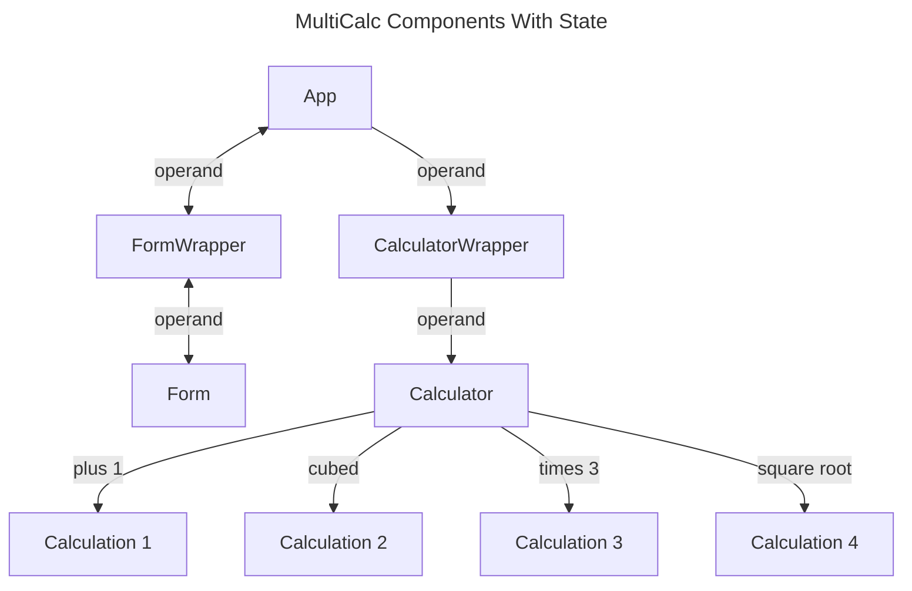

# # Discussion Topics

## Overview

No overview provided

## Learning Objectives

Learning objectives will be defined as the lesson progresses.

## Topics Covered

Topics will be covered as the lesson progresses.

## Status

pending

## Assignment

Assignment for Lesson 11

### Objective

No objective specified

### Expected Capabilities

Expected capabilities will be defined as the lesson progresses.

### Instructions

Instructions will be provided when the lesson is generated.

### Tasks

#### Task 1: Task 1

## Weekly Assignment Instructions

### Expected App Capabilities

After completing this week's assignment, your app should:

- Retain the same UI behavior and functionality after the refactor.
- Employ the reducer pattern to reduce state management complexity

### Instructions Part 1: Plan Initial State and Actions

This week you will refactor the todo and loading states to use the reducer pattern. Although the assignment will give you all of the action types, there is still a lot of work that goes into transferring over the correct logic to the reducer. Use whatever techniques you are comfortable with to take working notes so you can keep track of what progress you made.

All of the migration work will be from the App component since that is where all the affected state is managed. You will be combining state for:

- `todoList`
- `isLoading`
- `isSaving`
- `errorMessage`

#### State

- Create a new directory, `src/reducers`
- In that directory, create a new file named `todos.reducer.js`.
- Declare an `initialState` constant and assign it an object.
  - Add a property in this new object for each of the states you are going to combine.
  - Assign them the values that were passed into `useState` for their initial value. (eg: `todoList: [],`).
- Export `initialState` using a named export at the bottom of the file.

#### Actions

- Examine logic around related state update functions in the App component.
  - Take note of:
    - All locations where state values are used.
    - All state update function references or invocations.
    - Any logic whose sole purpose is to prepare a value passed to a state update function.
    - Any co-located state update functions for intermediate state
  - Remember optimistic and pessimistic strategies differ.
- Use these notes to identify code passages that can be grouped into actions.
- Compare the list of actions you came up with to the `actions` object below:

```js
const actions = {
    //actions in useEffect that loads todos
    fetchTodos: 'fetchTodos',
    loadTodos: 'loadTodos',
    //found in useEffect and addTodo to handle failed requests
    setLoadError: 'setLoadError',
    //actions found in addTodo
    startRequest: 'startRequest',
    addTodo: 'addTodo',
    endRequest: 'endRequest',
    //found in helper functions 
    updateTodo: 'updateTodo',
    completeTodo: 'completeTodo',
    //reverts todos when requests fail
    revertTodo: 'revertTodo',
    //action on Dismiss Error button
    clearError: 'clearError',
};
```

- Add this `actions` object to the top of the `reducers.js` file.
- Add `actions` to the file's named exports.

### Instructions Part 2: Create Reducer

- Below `actions`, define a `reducer` function that takes in a `state` and an `action`.
- Set the `state` parameter to equal `initialState`
- In the body of the function, define switch/case statement that evaluates `action.type`
- Add a `case` clause for each action in the actions object. Fore each clause:
  - Return an object that contains the destructured `state`

Each case should just return state unchanged. There is also no need to add a `break` statement since the clause returns a new state. Your reducer should look similar to the code below:

```js
// extract from todos.reducer.js
//...code

function reducer(state = initialState, action) {
  switch (action.type) {
    case actions.fetchTodos:
      return {
        ...state,
      };
    case actions.loadTodos:
      return {
        ...state,
      };****
//code continues...
```

### Instructions Part 3: Duplicate State Logic to Reducer

> [!warning]
> Commit progress into working branch! This will give you a good backup point in case you need to start over.

#### useEffect (Pessimistic UI)

Related actions: `fetchTodos`, `loadTodos`, `setLoadError`.

- In the reducer, update the `case` clause `actions.fetchTodos`
  - Add the `isLoading` property to returned state object and set it to `true`.
- Update `actions.loadTodos` clause:
  - Move the logic that maps each record from `records` into a todo.
  - Update the `...records.map` to use `...action.records.map`
  - Update the returned state object:
    - Add a `todoList` property and assign the resulting mapped array
    - Add `isLoading` and set it to false.
- Update the `actions.setLoadError` clause's state object:
  - Add `errorMessage` using `action.error.message`
  - Add `isLoading` set to `false`

#### addTodo (Pessimistic UI)

Related actions: `startRequest`, `addTodo`, `endRequest`, `setLoadError`

- Update the `actions.startRequest` clause's state object so that `isSaving` is `true`.
- Update `actions.addTodo` clause:
  - Copy over the logic that creates `savedTodo` and adds the `isCompleted` property when Airtable omits it from the record.
  - Update the returned state object:
    - Add a `todoList` property containing a new array destructuring `state.todoList` and `savedTodo`.
    - Add `isSaving` set to `false`
- Update the `actions.endRequest` clause's state to set `isLoading` and `isSaving` to `false`.
- Update the `actions.setLoadError` clause's state:
  - `errorMessage: action.error.message`
  - `isLoading: false`

#### updateTodo, completeTodo (Optimistic UI)

Related actions: `updateTodo`, `completeTodo`, `revertTodo`

- Copy the logic that updates the todo to the `actions.updateTodo` clause.
  - Use `action.editedTodo` wherever you used `updateTodo`'s argument.
  - Create a `const updatedState = {}` and destructure `state` and `updatedTodos` into it.
  - If there is an `error` property on the `action` object, add an `errorMessage` property onto `updatedTodos` set to `action.error.message`.
  - At the end of the clause, return the updated state.
- Copy the logic that completes a todo into `completeTodo` clause.
  - Replace `id` with `action.id` wherever the original `completeTodo` uses its argument.
  - Return the state with the `updatedTodos` destructured into the `todoList` property.
- The logic for `revertTodo` should be the same as `updateTodo.
  - If yes: make sure that the `revertTodo` case is written directly above `updateTodo` and remove the return statement. This will cause the action to fall through to the `updateTodo` case.
  - If they differ, copy the logic over and apply the same update patterns that we have gone through several times.

#### Dismiss Error Button

- Update the `actions.clearError` clause to set the `errorMessage` to an empty string.

### Instructions Part 4: Implement useReducer

- Import and alias reducer code.

```js
// extract from App.jsx
//...code
import {
  reducer as todosReducer,
  actions as todoActions,
  initialState as initialTodosState,
} from './reducers/todos.reducer';
//code continues...
```

- Call `useReducer` using `todosReducer` and `initialTodoState`.
  - Assign the state variable to `todoState` and the dispatch function to `dispatch`

### Instructions Part 5: Replace State and Logic with Action Dispatches

For each action that was defined, you need to replace the state update logic in App with a dispatch. If you ended up with differing actions, make sure that you take that into account as you are making the shift over to dispatched actions.

#### useEffect

Related actions: `fetchTodos`, `loadTodos`, `setLoadError`

- Replace `setIsLoading` with a dispatch: `dispatch({ type: todoActions.fetchTodos });`
- Replace `setTodoList` and the logic that maps records to todos with a dispatch:
  - Set the type to `loadTodos`.
  - Add the `records` to the action object.
- In the `catch` block:
  - Remove the `console.error` if you still have it.
  - Replace `setErrorMessage` with a dispatch for `setLoadError`. Include the `error` on the action object.

#### addTodo

Related actions: `startRequest`, `addTodo`, `endRequest`, `setLoadError`

- Replace `setIsSaving` with a dispatch that sets `todoState.isSaving` to true.
- Replace `savedTodo` and `setTodoList` with a dispatch `addTodo` and include `records` in the action object.
- Replace `setErrorMessage` and include the `error` on the dispatched action object.
- Replace `setIsSaving` with a dispatch that sets `todoState.isSaving` to false.

#### updateTodo, completeTodo

Related actions: `updateTodo`, `completeTodo`, `revertTodo`

- Replace `updatedTodos` and `setTodoList` with a dispatch to update the todo. Include the `editedTodo` on the action object.
- Remove the unneeded logic that updates the todo list with the updated todo. Hint: since updating a todo is an optimistic process, you do not have to do anything with the API response unless it includes an error.
- In the `catch block` dispatch a `revertTodo` that includes the `originalTodo`.
- Swap out state logic in `completeTodo` on your own.

### Instructions Part 6: Update References to State

- Replace all references to the old state to use the new `todoListState`. Eg: `<TodoForm onAddTodo={addTodo} isSaving={todoState.isSaving} />`
- Replace the state update function on the button's click handler to dispatch a `clearError` action instead of calling `setErrorMessage('').

### Instructions Part 7: Test Functionality

- Make sure your project starts without errors.
- Test app functionality:
  - [ ] Can you add a new todo? Does the new todo appear after it's saved to the API?
  - [ ] Can you edit an existing todo? Does it retain its edit after you refresh the page?
  - [ ] Can you complete a todo? Does is disappear from the page? Does it remain completed after you refresh the page?
  - [ ] Can you sort the todos? Filter them?
  - [ ] If you introduce a misspelling to the API's URL, do you get the expected errors from each user action?
  - [ ] If you misspell your personal access token (restart the app every time you change your environment file) do you get the expected errors?

### Stretch Goal: Refactor Remaining App-maintained State

The remaining state in App deals with the URL's query params. For additional practice, migrate the remaining state to the reducer that you've already created.

```
//remaining state in App:
const [sortDirection, setSortDirection] = useState('desc');
const [sortField, setSortField] = useState('createdTime');
const [queryString, setQueryString] = useState('');
```

- Plan initial states and actions.
- Update `intialState`
- Add identified actions to actions object and add cases to reducer.
- Duplicate over any logic that prepares state updates.
- Replace state updates with action dispatches.
- Removed unused code.

### Closing Notes

Next week we will be looking at React-Router and the advantages of being able to emulate browser navigation inside of an SPA.


```

```

### Submission Instructions

Please submit on time

### Checklist

Checklist will be provided when the lesson is generated.

### Check for Understanding

Understanding checks will be provided when the lesson is generated.

## Subsections

### # Discussion Topics

## Discussion Topics

### Advanced State

As an application grows, so too does the state that is needed to represent the UI. Adding more data or interactivity leads to an increasing number of state updates to orchestrate. Without careful management of state changes, troubleshooting interface bugs becomes challenging and increases the likeliness that a new feature may introduce bugs.

CTD Swag is starting to show signs of this problem, which can be identified by the quantity of `useState`'s found in any one component. Consider the `App` component:

```jsx
{/*extract from App.js*/}
{/*...code*/}
function App() {
  const [inventory, setInventory] = useState([]);
  const [filteredInventory, setFilteredInventory] = useState([]);
  const [cart, setCart] = useState([]);
  const [isCartOpen, setIsCartOpen] = useState(false);
  const [isCartSyncing, setIsCartSyncing] = useState(false);
  const [isAuthDialogOpen, setIsAuthDialogOpen] = useState(false);
  const [isAuthenticating, setIsAuthenticating] = useState(false);
  const [user, setUser] = useState({});
  const [authError, setAuthError] = useState('');
  const [cartError, setCartError] = useState('');
  const [cartItemError, setCartItemError] = useState('');
  const [isDialogOpen, setIsDialogOpen] = useState(false);
  const [isRegistering, setIsRegistering] = useState(false);
  const [isSortAscending, setIsSortAscending] = useState(true);
  const [sortBy, setSortBy] = useState('baseName');
  const [searchTerm, setSearchTerm] = useState('');
{/*code continues...*/}
```

All of the state update functions listed above are referenced at least once somewhere in the component. Many are found in two places. `setIsAuthenticating` is called in five locations!


`setIsAuthenticating` is found only in two event handlers, but but state update functions are also used in `useEffect`s and passed in props to child components. You can see how it can be easy to lose track of state!

#### The Reducer Pattern

The reducer pattern changes our approach to coordinating state updates in complex applications. In a broader software engineering context, a "reducer" is a design pattern that communicates events to a centralized function that performs all of the state updates in an app. It consists 3 key elements that work in concert to make state updates.

- **reducer function**: centralizes the logic needed to return updated state based on an `action` passed to it
- **action**: data that contains details that reducer uses to make state updates. It can of any data type, but it's most commonly an object containing a `type` and an optional `value` property.
- **dispatch function**: used to dispatch(as in _send_, not _kill_) an action to the reducer function.

```javascript
//example reducer and dispatches

//reducer accepts the current state and an action object
//it outputs an updated state value for us to use
const reducer = (state, action) => {
  switch (action.type) {
    case 'increment':
      return { ...state, count: state.count + 1 };
    case 'decrement':
      return { ...state, count: state.count - 1 };
    case 'add':
      return { ...state, count: state.count + action.value };
    case 'reset':
      return { ...state, count: 0 };
    default:
      return state;
  }
};
//dispatch containing an action object that adds 1
dispatch({ type: 'increment' });

//action objects can also be written outside dispatch
const decrement = {
  state,
  type: 'decrement',
};
dispatch(decrement);

//we can provide extra data for the reducer
//to compute the output value
const add5 = {
  state,
  type: 'add',
  value: 5,
};

dispatch(add5);

dispatch({ type: 'reset' });
```

> [!note]
> The code example above is non-functional but illustrates how those 3 elements work together. For CTD-Swag, we will be using the `useReducer` hook to help wire these to our app's state.

#### Inversion of Control

Up until now, we have focused on making state updates by processing events inside of event handlers and helper functions For example when a user adds a product to the cart:

1. user clicks button "Add to Cart"
2. the click event executes an event handler which:
   1. retrieves relevant data from state and the event
   2. transforms or creates a new value for next state
   3. calls a state update function with the state's next value
3. the state update function starts a render cycle which:
   1. replaces old state value with the update provided
   2. re-renders interface using new value

When working with reducers, it helps to shift perspectives from "what event just happened" to "what a user just did". This is referred to as [inversion of control](https://en.wikipedia.org/wiki/Inversion_of_control). Continuing with the example above, rather than thinking **"the user clicked on the 'Add to Cart' button on a product card representing the bucket hat"**, our new thought process would be **"the user added a bucket hat to their cart"**. This statement is much simpler than the first. It reflects that the component only needs to know that a user performed an action. The reducer function, which exists independently of the component, is responsible for adding the bucket hat to the cart state. Our event handlers' only responsibility for state updates is to communicate the details of the action to the reducer. We'll continue to explore the reducer pattern but need to learn a little about the `useReducer` hook first.

### Manage State with useReducer

The `useReducer` hook adapts the reducer pattern for use in React applications. Just like other hooks, it must be called at the top level of the component. React attempts to batch state changes so that if several happen in succession, they are all processed during the same render cycle. React also compares the reducer's output to its previous state - if nothing changes, it does not initiate a re-render.

`useReducer` takes a reducer function and an initial state value when called. It outputs a state value and a dispatch function which are assigned similar to `useEffect`.

```js
const [state, dispatch] = useReducer(reducer, initialState);
```

Reducer functions and the initial state values tend to be more complex than the arguments than a `useState` hook. The reducer function also works independently from any component: it reads no values from inside the component directly. Because of these factors we will place these in a separate file to keep the component's size to a minimum.

For this discussion, we will implement the reducer pattern on cart's state. We create a file `cart.reducer.js` and place it into a `/reducers` folder created under `/src`. It's helpful to drop the "x" from the filename's extension since it will not contain any React-specific code or JSX. This will tell us, at a glance that it is not component code without having to open the file up. After creating the new file, we when need to identify the relevant `useState`s:


The `useState`s highlighted above all manage some aspect of state related to the cart. From this list, we can determine `initialState`:

```js
// extract from cart.reducer.js
const initialState = {
  cart: [],
  isCartOpen: false,
  isCartSyncing: false,
  //for the sake of simplicity here, we combine cartError and cartItemError
  error: '',
};
//code continues...
```

We then create a reducer that returns the state for now.

```js
// extract from cart.reducer.js
//...code
function reducer(state, action) {
  switch (action.type) {
    default:
      return state;
  }
}

export { initialState, reducer };
```

We will add `case` statements for each of the actions we identify to organize the state logic. `switch/case` flow control is easier to read than `if/else` statements so is usually preferred. Reducer functions tend to grow quite long.

We then import the initial value and the reducer into `App.js` and add them to a `useReducer` hook:

```jsx
{
  /*extract from App.jsx*/
}
{
  /*...code*/
}
import {
  //aliasing with `as` keeps the reducer and state easily identifiable
  initialState as cartInitialState,
  reducer as cartReducer,
} from './reducers/App/cart.reducer';

{
  /*...unrelated code...*/
}

const [cartState, dispatch] = useReducer(cartReducer, cartInitialState);
{
  /*code continues...*/
}
```

Next, we'll find places where `isCartOpen` is used and determine how argument is created. In some cases, it's a direct value that is passed in. In other cases, our event handlers and helper functions calculate that value. Using VS Code's file search we can find 3 instances to `setIsCardOpen`.


The first location is in `useState` so we do not need to worry about that for now. The second one is in a handler function that closes the cart and the final on is in the Header instance:

```jsx
{/*extract from App.jsx*/}
{/*...code*/}
 function handleCloseCart() {
  {/*used here*/}
     setIsCartOpen(false);
     setAuthError('');
 }
/*...unrelated code...*/
 <Header
  cart={cart}
  {/*used here*/}
  handleOpenCart={() => setIsCartOpen(true)}
  handleOpenAuthDialog={handleOpenAuthDialog}
  handleLogOut={handleLogOut}
  user={user}
    />
{/*code continues...*/}
```

They **close** and **open** the cart respectively. These actions will be the basis of the action objects the we eventually write. Both locations set the boolean value directly so we don't have any state logic to move over to the reducer other than updating those values.

We add a `case` statement for each of these actions to the reducer. From each we return a new object that spreads the original `state` and a new value for the `isCartOpen` property.

```js
// extract from cart.reducer.js
function cartReducer(state, action) {
  switch (action.type) {
    case "open":
      return {
        ...state,
        isCartOpen: true,
      };
    case "close":
      return {
        ...state,
        isCartOpen: false,
      };
    default:
   return state;
//...code
//code continues...
```

Before removing any state update function, we can place the dispatch along side it if we need to do any troubleshooting. We can the log the reducer's output to ensure the action's `case` block functions as expected.

Recall that the dispatch function takes an `action`. This can be of any type (string, object, number, etc.) but by convention, we stick with objects containing a `type` property to identify the action and add properties as needed. The actions that our reducer will receive for the cart actions resemble:

```javascript
const open = { value: 'open' };
const close = { value: 'close' };
```

When we are happy with how the `case` blocks work in the reducer, we can then update all `isCartOpen` references with `cartState.isCartOpen` to migrate to the updated state.

We then update each `isCartSyncing` with `cartState.isCartSyncing` to use the state our `useReducer` returns.

```jsx
{
  /*extract from */
}
{
  /*...code*/
}
{
  cartState.isCartOpen && (
    <Cart
      cartError={cartError}
      isCartSyncing={isCartSyncing}
      cart={cart}
      handleSyncCart={handleSyncCart}
      handleCloseCart={handleCloseCart}
    />
  );
}
{
  /*code continues...*/
}
```

After completing these updates, our cart behaves the same but that state is now fully managed by the reducer.


We are now left with 5 more `useStates` to refactor.

```javascript
const [cart, setCart] = useState([]);
const [isCartOpen, setIsCartOpen] = useState(false); //DONE
const [isCartSyncing, setIsCartSyncing] = useState(false);
const [cartError, setCartError] = useState('');
const [cartItemError, setCartItemError] = useState('');
```

Besides `cart`, each other state value update employs the same complexity as `isCartOpen`. We'll refactor these without discussion so we can then explore how we identify actions and refactor the state updating logic over to our reducer.

Refactoring `cart` is the most complex because of the differing ways that the user interacts with the contents of their cart. I`setCart` is referenced in 7 places in `App.jsx` excluding the `useEffect`

- 1 time in `handleAuthenticate`
  - when a user logs in and has a saved cart, `setCart` receives `userData.cartItems` from the API response
- 2 times in `handleSyncCart`
  - when a user is not logged in and they confirm a cart change, `setCart` receives `workingCart`
  - when a user is logged in and they confirm a cart change, `setCart` receives the `cartData` from the API
- 3 times in `handleAddItemToCart` (this is the most complex set of uses since we used an optimistic approach to managing `cart` state)
  - when a user adds an item the event handler:
    - it finds if there's a matching item in the cart.
      - if yes, it creates a duplicate cart item then increments the matching item quantity
      - if no, it creates a new cart item with a quantity of 1
    - it then calls `setState` with an array which includes the newest item
    - if an API response fails, the cart item is reverted to:
      - previous value if it has a quantity greater than one or
      - removes it if its quantity is 1
- 1 time in `handleLogOut`
  - `setCart` receives an empty array to empty the cart

We can distill this list into two actions: **"add item"** and **"update cart"**

- A user logs in and they have a saved cart that is loaded: **"update cart"**
- A user modifies item counts in the cart: **"update cart"**
- A user adds an item to their cart: **"add item"**
- A user logs out which empties the cart: **"update cart"**

"add item" ends up being the more complex of the two because of the data manipulation required to make cart items out of products in the product list. We will take care of "update cart" first since it operates on the whole cart and, as a result, has less supporting logic.

In each occasion where we plan on using the "update cart" action, the reducer is going to receive an action object with a cart value that replaces the existing cart. In each of the areas where we use this action, we are going to pass an updated cart received from the API or when a user confirms a cart edit.

We'll update the cart reducer to include a `case` for "update cart" and add in the logic that returns the new cart value we will place into the action object.

```js
// extract from cart.reducer.js
//...code
function CartReducer(state, action){
 switch(action.type) {
  case "open":
      return {
          ...state,
          isCartOpen: true,
      };
  }
//code continues...
  case "update"

}
```

We can then go back to the codebase and replace the `setCart`s where we intend on dispatching the "update cart" action. You can also see the other dispatches that have already been placed in `handleSyncCart` and `handleAuthenticate` to deal with other aspects of cart state.

```jsx
//extract from App.jsx
//...code
const handleSyncCart = useCallback(
  async (workingCart) => {
    if (!user.id) {
      //dispatch replaces setCart here
      dispatch({ type: 'update cart', cart: workingCart });
      return;
    }
    dispatch({ type: 'sync' });
    const options = {
      method: 'PATCH',
      body: JSON.stringify({ cartItems: workingCart }),
      headers: {
        'Content-Type': 'application/json',
        Authorization: `Bearer ${user.token}`,
      },
    };
    try {
      const resp = await fetch(`${baseUrl}/cart`, options);
      if (!resp.ok) {
        console.log('resp not okay');
        if (resp.status === 401) {
          throw new Error('Not authorized. Please log in.');
        }
      }
      const cartData = await resp.json();
      if (cartData.error) {
        throw new Error(cartData.error);
      }
      //dispatch replaces setCart here
      dispatch({ type: 'update cart', cart: cartData });
    } catch (error) {
      console.error(error);
      dispatch({ type: 'error', error: error.message });
    } finally {
      dispatch({ type: 'not syncing' });
    }
  },
  [user.id, user.token, dispatch],
);
//code continues...
async function handleAuthenticate(credentials) {
  const options = {
    method: 'POST',
    body: JSON.stringify(credentials),
    headers: { 'Content-Type': 'application/json' },
  };
  try {
    setIsAuthenticating(true);
    const resp = await fetch(`${baseUrl}/auth/login`, options);
    if (!resp.ok) {
      if (resp.status === 401) {
        setAuthError('email or password incorrect');
      }
      throw new Error(resp.status);
    }
    const userData = await resp.json();
    setUser({ ...userData.user, token: userData.token });
    dispatch({
      type: 'update cart',
      cart: userData.cartItems,
    });
    setAuthError('');
    setIsAuthenticating(false);
    setIsAuthDialogOpen(false);
  } catch (error) {
    setIsAuthenticating(false);
    console.log(error.message);
  }
}
//code continues...
```

We then have to determine the logic for the "add item" action. The first challenge is that the logic filters through the inventory list to ensure the item exists before making a new cart item or incrementing the quantity on an existing cart item. Since our reducer exists independently from the App component, we need to include the inventory on the action object.

With this in mind, we can move over the logic and update any `inventory` references to `action.inventory` and create a return value that reflects the updated state:

```js
// extract from cart.reducer.js
//...code
 case cartActions.addItem: {
      const inventoryItem = action.inventory.find(
        (item) => item.id === action.id
      );
      if (!inventoryItem) {
        return state;
      }
      const itemToUpdate = state.cart.find(
        (item) => item.productId === action.id
      );
      let updatedCartItem;
      if (itemToUpdate) {
        updatedCartItem = {
          ...itemToUpdate,
          quantity: itemToUpdate.quantity + 1,
        };
      } else {
        updatedCartItem = {
          ...inventoryItem,
          quantity: 1,
          productId: inventoryItem.id,
        };
      }
      return {
        ...state,
        cart: [
          ...state.cart.filter((item) => item.productId !== action.id),
          updatedCartItem,
        ],
      };
    }
//code continues...
```

Almost done! Now we have to back to the App component and change all `cart` references to `cartState.cart`. These are found as props given to the Header component and the Cart component:

```jsx
{
  /*extract from App.jsx*/
}
{
  /*...code*/
}
<Header
  cart={cartState.cart}
  handleOpenCart={() => dispatch({ type: 'open' })}
  handleOpenAuthDialog={handleOpenAuthDialog}
  handleLogOut={handleLogOut}
  user={user}
/>;
{
  /*...code...*/
}
{
  cartState.isCartOpen && (
    <Cart
      cartError={cartState.error}
      isCartSyncing={cartState.isCartSyncing}
      cart={cartState.cart}
      handleSyncCart={handleSyncCart}
      handleCloseCart={handleCloseCart}
    />
  );
}
{
  /*code continues...*/
}
```

After these changes, our cart behaves as it did previously, but all of its state is now managed by the reducer. Because the reducer, dispatch function and the action are so tightly coupled, the reducer function is probably one of the most complex things we have covered so far. While it is harder to employ, it is far easier to manage complex state this way than relying on numerous `useState`s and we also end up with a much more compact function.

### Passing Data Using useContext

Managing state used by several components is a fundamental aspect of building interactive IUs. React's `useContext` hook simplifies the flow of shared state across deeply nested components. We'll refactor a demo app, named MultiCalc, to take advantage of `useContext`.

#### MultiCalc's State

MultiCalc performs 4 pre-defined calculations on an operand that a user inputs:


Here is the app structure with state flow:



The `operand` state has been hoisted up to `App` because it needs to be available to `Form` and `Calculator`. `Form` is a controlled form so manages its working state based on `operand`. When a user hits the submit button, it calls `setOperand` and passes `Form`'s working state to update `operand`. On the other side of the component tree, the `Calculator` component consumes `operand` to calculate each of the results that are passed down to each `Calculation` component.

#### The Problem

We can see from the diagram above that there are two components, `FormWrapper` and `CalculatorWrapper`, that stand between `Form` and `Calculator`, and `App`. A look at these components' code reveals that `operand` and `setOperand` are being passed through without being read:

```jsx
{/*FormWrapper.jsx*/}
import Form from './Form';

function FormWrapper({ operand, setOperand }) {
  return (
    <>
      <Form operand={operand} setOperand={setOperand} />
      <hr />
    </>
  );
}

{/*code continues...*/}
```

```jsx
{/*CalculatorWrapper*/}
import Calculator from './Calculator';

function CalculatorWrapper({ operand }) {
  return (
    <>
      <h2>Calculations</h2>
      <Calculator operand={operand} />
    </>
  );
}

export default CalculatorWrapper;

{/*code continues...*/}
```

Not using props, other than to pass it to a child component, is called [props drilling](https://react.dev/learn/passing-data-deeply-with-context#the-problem-with-passing-props). Excessive prop drilling can lead to harder to write components and difficulty while troubleshooting state.

#### Context to the Rescue

When we employ `useContext`, we are accessing a "context" shared across a portion of the component tree. Context refers to a state that can be shared among multiple components in a React application. This allows data to be passed directly from an ancestor component through the component tree without having to explicitly pass props at every level.

Like the `useReducer` hook we have some additional set up to perform before we can use this hook. Before doing so, lets look at the three items that are needed to set up and use context.

1. `createContext`
2. `context` object
3. `useContext`

#### `createContext`

`createContext` must be called outside of a component to create the context object. The function takes an optional `defaultValue` that can be of any type - string, number, object, etc. This acts is a fallback value for the context where there is no matching provider (more on "Provider next...) anywhere in a component's tree. It is a best practice to call it `null` rather than leave the argument empty.

Invoking `createContext` outputs a `context` object. This object is exported so it can be used in other components. We can create the context in a component's file but in larger applications, context usually created in a dedicated `/context` directory, similar to how reducers have a `/reducers` directory. The example below shows how `createContext` is used to create a context, `ExampleContext`.

```jsx
import { createContext } from 'react';

export const ExampleContext = createContext(null);
```

#### `context` Object

This object represents the context that will be used. This object has two properties that we work with: A `Provider` component and a `Consumer` component. The `Provider` component is used in a parent component to set the value for the context that is shared with its children. `Provider` takes a `value` prop and children. With this Provider in place, the context value is set to 42 which is "globally available" to any component nested within it regardless of how far down the tree.

```JSX
import {createContext} from 'react';
import {ChildComponent} from './ChildComponent'

export const ExampleContext = createContext(0);

function App(){
    return(
        <ExampleContext.Provider value={42} >
            <ChildComponent />
        </ExampleContext.Provider>
    )
}
```

The context object's other component `Consumer` provides a different approach to working with `context` but is rarely ever used so we will not be covering it.

#### `useContext`

With `useContext`, ancestor components can access and update this shared global state. The hook takes in the the context that was created by `createContext` and returns the context's `value` when called.

```jsx
import {useContext} from `react`;
import {ExampleContext} from `./ExampleComponent`;

function GreatGrandChildComponent(){

const exampleValue = useContext(ExampleContext);

return(
    <div>
        <p>{exampleValue}</p> {/* 42 until parent updates state*/}
    </div>
)
}
```

With those parts out of the way, [React's documentation suggests](https://react.dev/learn/passing-data-deeply-with-context) that we think about implementing context in three steps:

1. **Create** a context object
2. **Use** the context with `useContext` to replace props that were passed down from component managing state
3. **Provide** context wrapping children with Provider and passing a `value` props that the parent still manages

#### `useContext` in Action

##### Create a Context

For MultiCalc, we'll create an `OperandContext` above the App component. We'll call it with `null` since the context does not have any meaningful value outside of its use to manage `operand` state.

```jsx
{/*extract from App.jsx*/}
{/*...code*/}
export const OperandContext = createContext(null);

function App() {
    const [operand, setOperand] = useState(0);
{/*code continues...*/}
```

``
If ESLint is configured, our IDE will warn us that Vite's fast-refresh doesn't work with component files that include named exports. We can ignore that yellow squiggle. This is a performance consideration that should be addressed in a real-world project but we will not worry about it here.


##### Use the Context

The Form component will need `operand` and `setOperand`. We start by importing `OperandContext` from App.jsx and calling `useContext` with `OperandContext` as the argument. We know we are going to place both the state and state updater function into context's value so can use destructuring when assigning our values. `const { operand, setOperand } = useContext(OperandContext)`. We can then treat these values as drop-in replacements for the props that were on the component and remove them from `Form` and `FormWrapper`.

```jsx
{/*extract from Form.jsx*/}
import { useState, useEffect, useContext } from 'react';
import { OperandContext } from './App';

// props { operand, setOperand } have been removed
function Form() {

    const { operand, setOperand } = useContext(OperandContext);
    const [workingOperand, setWorkingOperand] = useState(0);

    useEffect(() => {
        setWorkingOperand(operand);
    }, [operand]);

    function handleSubmit(e) {
        e.preventDefault();
        if (workingOperand != '') {
          setOperand(parseFloat(workingOperand));
        }
    }
    return (
        <form>
            <label htmlFor="value">Calculate with: </label>
            <input
            type="number"
            id="value"
            value={workingOperand}
            onChange={(e) => setWorkingOperand(e.target.value)}
            />
            <button onClick={handleSubmit} disabled={workingOperand === ''}>
                Submit
            </button>
        </form>
    );
}

export default Form;
```

We can also remove the props from `<FormWrapper />`.

```jsx
{/*extract FormWrapper.jsx*/}
import Form from './Form';

//props no longer needed!
function FormWrapper() {
    return (
        <>
            <Form />
            <hr />
        </>
    );
}
export default FormWrapper;
```

##### Provide the Context

At this point, the form will not work until we provide the context. We place an instance of `OperandContext.Provider` in App's markup then nest the children components in between its tags. We finally pass the state App is managing to the provider's `value` props. Conventions on how to form the context's value vary but be sure to keep it consistent across a codebase.

```jsx
{/*extract from App.jsx*/}
{/*...code*/}
function App() {
    const [operand, setOperand] = useState(0);
    
    return (
        <main>
            <h1>MultiCalc</h1>
            <OperandContext.Provider value={{ operand, setOperand }}>
                <FormWrapper />
            </OperandContext.Provider>
            <CalculatorWrapper operand={operand} />
        </main>
    );
}
{/*code continues...*/}
```

Now that the form works again, we can go through the same steps to use context in the `Calculator` component. We import the context from App and then invoke `useContext` with it. We don't need `setOperand` so we only destructure out `operand` from the `useContext`'s return value. We can then remove the props from it and it's parent component, `CalculatorWrapper`.

```jsx
{/*extract from Calculator.jsx*/}
{/*...code*/}
function Calculator() {
    const { operand } = useContext(OperandContext);
{/*code continues...*/}
```

```jsx
{/*CalculatorWrapper.jsx*/}
import Calculator from './Calculator';

function CalculatorWrapper() {
return (
    <>
        <h2>Calculations</h2>
        <Calculator />
    </>
);
}

export default CalculatorWrapper;
```

MultiCalc is now working with the context provided in App. React's developer tools reflect this change, showing `Context.Provider` in the component hierarchy.


The dev tools also show that Form and Calculator are both using the `useContext` hook.


**Video URL:** No video available

**Code Examples:**

No code examples available

**External Links:**

No external links available

**Quizzes:**

No quizzes available

## Supplemental Videos

No supplemental videos available

## References

No references available

## Podcast URL

No podcast available