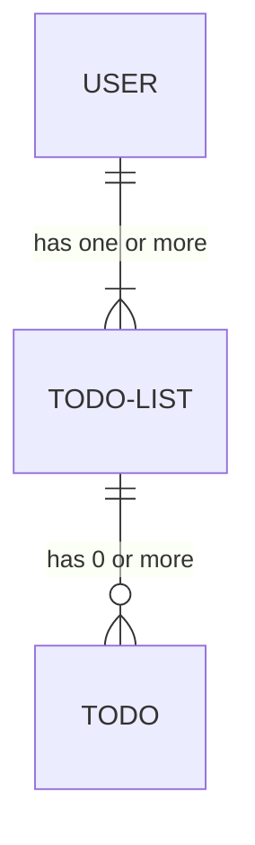
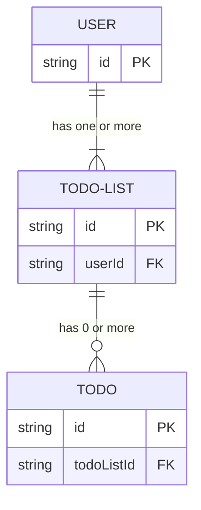
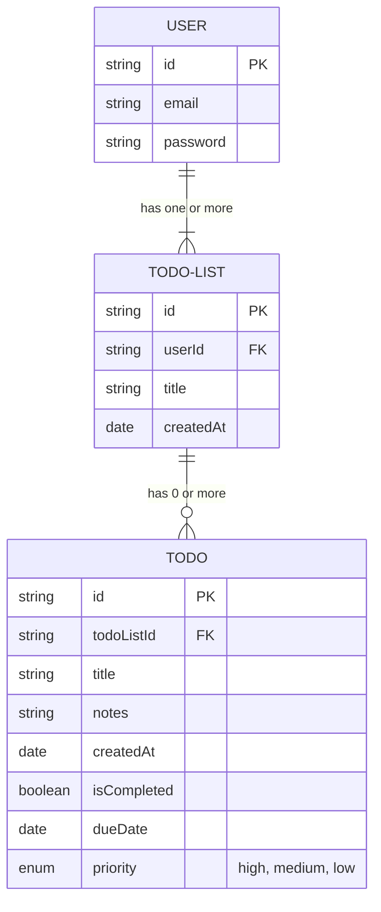

# # Discussion Topics

## Overview

No overview provided

## Learning Objectives

Learning objectives will be defined as the lesson progresses.

## Topics Covered

Topics will be covered as the lesson progresses.

## Status

pending

## Assignment

Assignment for Lesson 14

### Objective

No objective specified

### Expected Capabilities

Expected capabilities will be defined as the lesson progresses.

### Instructions

Instructions will be provided when the lesson is generated.

### Tasks

#### Task 1: Task 1

## Weekly Assignment Instructions

Final project checklist:

- [Downloadable PDF version](https://raw.githubusercontent.com/Code-the-Dream-School/react-curriculum-v3/refs/heads/main/learns-app-content/reusable-content/final-project-checklist.pdf)
- [Downloadable markdown version](https://raw.githubusercontent.com/Code-the-Dream-School/react-curriculum-v3/refs/heads/main/learns-app-content/reusable-content/final-project-checklist.md)

There are no coding assignments to submit this week. Start with your final project based on the discussions above. Don't forget that there is may be a mindset response to turn in though!


```

```

### Submission Instructions

Please submit on time

### Checklist

Checklist will be provided when the lesson is generated.

### Check for Understanding

Understanding checks will be provided when the lesson is generated.

## Subsections

### # Discussion Topics

## Discussion Topics

### Final Project Requirements

Over the past 13 weeks, we've discussed React's major features and techniques to employ to create a rich and interactive SPAs. You've watched several example apps come together and you practiced concepts on the todo list. This final, 2 week project demonstrates this gained knowledge. You'll have an opportunity to build out a React app that can take a proud place in your developer portfolio!

- [Downloadable PDF version of the checklist](https://raw.githubusercontent.com/Code-the-Dream-School/react-curriculum-v3/refs/heads/main/learns-app-content/reusable-content/final-project-checklist.pdf)
- [Downloadable markdown version of the checklist](https://raw.githubusercontent.com/Code-the-Dream-School/react-curriculum-v3/refs/heads/main/learns-app-content/reusable-content/final-project-checklist.md)

#### General

- [ ] Uses a public Github repo.
- [ ] Scaffolded using Vite with the `react` (not `react-ts`, `react-swc`, or `react-swc-ts`) template.
- [ ] Uses NPM
- [ ] Installs and uses dependencies: "react-router".

#### Coding Practices

- [ ] Formatting should be neat and consistent across the codebase. Prettier can help with this!
- [ ] Only 1 component per file unless using Styled-Components.
- [ ] Component names should be in PascalCase and filenames should match the components they house.
- [ ] Minimize the use of implicit type coercion.
- [ ] Favor functional over non-functional approaches. (eg: use array.prototype.map instead of array.prototype.forEach)
- [ ] Comments should be concise and only used for explaining tricky or complex code passages. Remove all commented-out code and personal notes.
- [ ] Project files that contain only utility or helper functions and no components should be given the `.js` extension.

#### Project Structure

##### Repo Structure

- [ ] Root directory contains:
  - [ ] src/
  - [ ] .env.local.example file with example values for all environmental variables needed to run project
  - [ ] .gitignore which includes at least the following entries:
    - [ ] `node_modules`
    - [ ] `dist`
    - [ ] `*.local` (this covers the `.env.local` file you use for secrets)
    - [ ] `.DS_Store`
  - [ ] index.html - the only changes permitted are in the `<head></head>`
    - [ ] 3rd-party stylesheets are permitted if used in conjunction with an installed library. All other styling should be in src/
  - [ ] package.json
  - [ ] package-lock.json`
  - [ ] vite.config.js
  - [ ] README.md which includes:
    - [ ] Project title and description
    - [ ] Details on any added dependencies, especially those that may manipulate the DOM directly.
    - [ ] Instructions on how to install and run
    - [ ] Any details needed for an API connection
      - [ ] If credentials needed, indicate services used
- [ ] Root should NOT contain:
  - [ ] node_modules/
  - [ ] .env.local or any other file with sensitive information
  - [ ] Any component files other than App.jsx and main.jsx
  - [ ] any Yarn artifacts
- [ ] `public/` - the favicon can be changed but this directory should not be used
- [ ] `src/` directory contains at minimum:
  - [ ] `assets/` directory for all included imagery, fonts, etc, unless they are retrieved from an external source.
  - [ ] `features/` directory containing at least 2 features
    - [ ] If features use more than one component, all related components should reside in a sub-directory with the feature name.
  - [ ] `pages/` directory containing at least 3 page components
  - [ ] `shared/` directory containing at least 2 components that are used in more than one feature
  - [ ] App.css
  - [ ] App.jsx
  - [ ] main.jsx
- [ ] Other directories may be added so long as the assist in keeping the project's code well-organized.

##### Project Data Schema Structure

- [ ] use any approach accessible to you (look back to the discussion) to create 1 or more objects or arrays of objects to load into state or save to state
- [ ] use the simplest structures needed to model data in your application

#### Demonstrates Understanding of React Concepts

- [ ] The browser's page should never refresh during user interaction.
- [ ] All components should be functional (no class-based components).
- [ ] Use only React-compatible props.
- [ ] State should never be mutated.
- [ ] Components should return valid JSX.
- [ ] The DOM should never be directly accessed or manipulated unless required by a 3rd-party library.
  - [ ] Make a note of any libraries that do this in the README.
- [ ] All communication with external data sources should be done asynchronously.
- [ ] Project uses at least:
  - [ ] 1 component that takes `children` props
  - [ ] 2 re-usable components each containing 2 or more html elements/sub-components + uses props
  - [ ] 4 conditionally rendered components or elements.
  - [ ] 1 controlled component form with at least 1 validated field.
  - [ ] 2 `useEffect` calls.
  - [ ] 1 `useCallback`.
- [ ] All dependency arrays for hooks are accurate for their use case.
- [ ] `useEffect` calls should return a cleanup function as appropriate.
- [ ] Any array of rendered components must include a unique `key` props.
  - [ ] Keys must not be derived from the item's index.

#### Uses React-Router for Routing

- [ ] react-router is installed in the project.
- [ ] The `App` component instance in main.jsx is wrapped with a `BrowserRouter` instance.
- [ ] Includes at least 2 routes.
- [ ] All `Route` instances use components in the `pages/` directory for their element props.
- [ ] Include a wildcard route with a "Not Found" page.
- [ ] Uses `NavLink` instances for global navigation (can use `Link` instances elsewhere)

#### Behavior

##### Startup

- [ ] Installs without error (other than minor package updates)
- [ ] Application starts without errors.
- [ ] On loading, application performs a network request or interacts a browser storage mechanism to retrieve data used in app.
  - [ ] Loading status is displayed to user in UI.
  - [ ] *Reviewers need to be able to access whatever resource is used with minimal setup!*
    - [ ] Any publicly accessible APIs used must be open for anonymous use or free to sign up for.
    - [ ] If a local server is used:
      - [ ] **Warning: mentors will not be able to assist with troubleshooting any server issues** so this option is best for those with adequate experience!
      - [ ] it must use Node.js as a runtime (no Deno, Bun, Python, Ruby, PHP etc.)
      - [ ] it must run error-free
      - [ ] A link to its repo and setup/running instructions are included in the project's README

##### Functionality

- [ ] All components and any user interactions should be error-free (excluding anything beyond student's control, such as API uptime). Warnings are acceptable.
- [ ] The app should never crash.
- [ ] StrictMode must remain in place in main.jsx
- [ ] Form inputs and labels must be properly associated with each other.
- [ ] Any foreseeable network or process errors must be caught and communicated to the user, as appropriate, through the UI.
- [ ] App allows user to interact with data central to the purpose of the app.
  - [ ] Create
  - [ ] Read
  - [ ] Update
  - [ ] Delete (optional)
- [ ] Persists data using an API and/or Local Storage or IndexedDB.

#### Appearance/UX

- [ ] Styling should only be written using CSS, CSS Modules, or Styled-Components. No component or theming libraries.
  - [ ] Exceptions can be made for notification systems - seek CIL approval first.
- [ ] Uses consistent theming and layouts across pages and elements.
- [ ] Uses a different font for headings and non-heading text.
- [ ] Interface text is legible for the typical user.
- [ ] Images must include brief, descriptive alt text (this excludes images that serve only as decoration).
- [ ] Any sounds used must be mutable from within the app's interface.
- [ ] `NavLink` instances should visually differentiate between the currently active route's link and other, inactive route links.
- [ ] Imagery and other assets should generally be optimized for the sizes that they are being used. (eg: don't use a 4k resolution, 2MB jpg for a 5cm tall user avatar!)

### Planning Your Project

#### Finding an Idea

During the final 2 weeks of this course, you will create a React app from scratch! This project will demonstrate that you understand all the basic concepts of working with React to build an SPA. While coming up with idea for your project, make sure that it is complex enough to meet all of the project requirements but small enough to complete in 2 weeks. For reference, the todo list that we have been working is on easy side but the CTD-Swag storefront is much more complex.

If you don't have any app ideas yet, doing an internet search for "React application ideas", "front end projects" or anything along those lines will land numerous lists of app ideas to consider. However, some of the best ideas come from your personal experience though. It could help with some hobby or occupation, be entertaining like a game or puzzle, or solve some other challenge that you are interested in.

#### Consider Possible Features

As you explore potential app ideas, consider the major features that it it could include. It's often helpful to think of them along with how the user interacts with the application. Here are a few examples:

**Recipe Finder**

- Users can search for and view recipes.
- They can create their own recipes.
- They can rate recipes and save favorites
- They can create shopping lists from recipes.

**Fitness Tracker**

- Users can log their daily workouts, track repetitions, and weights used.
- They can set workout goals and track progress.
- They can receive workout suggestions based on fitness level.

So that we have single app to help illustrate points without ruining any of your potential ideas, we'll expand the todo list app that we've been working on. We'll start by describing it similar to the examples above:

**Todo List**

- Users can log into an account that is used to manage their todos.
- Users can create, edit, delete, and mark todos as completed.
- They can set due dates, prioritize todos, and organize them into different todo lists.
- They can sort and search todos.

#### Data

We then need to consider the data used to manage state in the app. This is usually comes in two forms: either, 1.) the major data entities (usually objects or an array of objects) in the system or 2.) the transient UI state employed to indicate long-running operations. For the todo list, the major entities would include:

- The user
- Todo lists
- Todos

##### Entity Relations

Defining the relationship between the major data entities in your app may be one of the most challenging aspects of planning unless you have some background with relational databases. You may end up choosing the same sort of schema that we used in the todo app. This pulls and saves data to a single table and may be enough for your purposes.

To give you some other options to explore, we'll simplify some of relational database concepts so we can model some common data relationships that you may need to work with. We'll look at each entity and determine how many of another entity they interact with and how they interact. The common relationships that we will look for:

- one to many
- many to many
- many to one
- one to one

Going back to the enhanced todo list, we can identify several relations between a user, todos, and todo lists.

- **One** user can have **many** todo lists, but a list can only be owned by one user: one to many
- **One** todo list can have **many** todos, but a todo can only belongs one todo list. one to many
- **Many** users can have **many** todo lists. Since users don't interact or share todo lists the app does not need to address a "many users" relation. This relationship commonly employs a "join" table that does nothing more than connect a `userId` to a `todoListId`. This sort of relation often appears in social apps or where there are many users using a single platform collaboratively.
- **Many** todos can have only **one** todo list. And **many** todo lists can have only **one** user. This is just an awkward way of saying a todo (no matter how *many* of them are in the system) can only belong to a single todo list and that a todo list can only belong to a single user. Just like the many to many relationship, these relations often appear in social apps.
- A **one** to **one** relation doesn't exist in the todo app.

The relationships found in the todo list app can be expressed in the form of an [ER](https://www.geeksforgeeks.org/introduction-of-er-model/) (entity relation) diagram:



We then use `id`s as a means to tie the "many" side of the relationship to the single entity's side. Each todo list will include a `userId` property that is given the user's `id`. We'll be able to identify all the user's lists by looking at the `userId` property. The same goes for each todo: as a todo is added to a list, it will have a `listId` property that will be set to the list's id. It may change as the user moves todos from one list to another but it still references a list that is owned by a user.

We don't have to define a relationship in this model between the user and the todos because it's already been done. A todo can only belong to one list and a list can only belong to one user. Since that can be traced back, we don't need to include a `userId` property on each of the todos.



##### Entity Properties Needed for State

Let's also take some time to identify the properties for each entity. While doing so, try to stick with the least amount of properties possible to properly manage state around that entity. The app would need a user's login credentials, a title for each todo list, and enough properties on each todo object so that the user is able to:

- name the todo
- set a due date
- add additional notes
- set a priority level
- complete the todo
- know how old it is

We'll add those properties to the ER diagram:



##### Transient UI State

Transient state for the todo app includes:

- rendering temporary "processing" indicators while:
  - a user is being authenticated
  - a todo is saving to the API
  - a todo list is being created or modified
- reverting a todo to an older version if there was an API error.

#### Wireframing

After establishing the data needed for the app, we need to start thinking about the visual layout. Sketching out pages and how they are broken down into components is often called wireframing. If you are comfortable with digital tools like [Figma](https://www.figma.com/) or [PenPot](https://penpot.app/), you can use them. If not, a pencil and some paper works fairly well. We'll start with the biggest elements which are each of the feature pages, and then divide them down into regions, grouping related elements together.


 We can already identify 2 common components that are shared between features - the header and the navigation menu. Beyond that, each todo list tab and each todo are reusable components. The button to submit a new todo could potentially be re-used in the auth/login panel and a form to update user information. Account information will most likely consist of a form where a user can update their details. The about page will include descriptive text about todo app.

It's very tempting to go in to minute detail when building a wireframe but only expend the time necessary to better understand how the interface can be broken down into components. You can refine this into a full design prior to starting active work on the app but it will be up to you how detailed it is.

#### Technologies

This part of the project planning will differ widely between projects. Project requirements aside, some may need 3rd party libraries while others may not. The todo list app does not need any but we can discuss some of the considerations when looking to bring in other tools. You can search for popular JavaScript libraries on [GitHub](https://github.com/explore) or [NPM](https://www.npmjs.com/). Online developer communities are also a good source of information as long as you disregard some of the hot takes.

- [DEV Community](https://dev.to/)
- [webdev: reddit for web developers](https://www.reddit.com/r/webdev/)
- [Bringing the web out of 2007 since 2013.](https://www.reddit.com/r/Frontend/)
- [Javascript - GameDev.net](https://www.gamedev.net/tag/javascript/)
- [Discord Servers - Home](https://discord.com/servers)
- [Latest JavaScript topics - The freeCodeCamp Forum](https://forum.freecodecamp.org/c/javascript/421)

**Compatibility and Maintainability**: Ensure that the library is compatible with our React version and other dependencies. Evaluate the library's flexibility and customization options to meet your specific project needs.

**Popularity and Community Support**: Check the library's popularity ([GitHub Stars](https://docs.github.com/en/get-started/exploring-projects-on-github/saving-repositories-with-stars), [NPM](https://docs.npmjs.com/about-the-public-npm-registry) weekly downloads), active community engagement on GitHub Issues or the author's support platform, and frequency of updates. Libraries with a strong user base and ongoing support are likely to be more reliable and well-maintained. Check for reviews, feedback, and recommendations from other developers who have used the library. Consider their experiences, insights, and any potential issues they have encountered when integrating the library into their projects.

**Documentation**: Review the library's documentation for clarity, completeness, and examples. Well-documented libraries make it easier for developers to understand the functionality, implementation, and integration of the library into their projects.

**Limitations for this course**: Make sure you are not using any styling/theming libraries or component libraries other than CSS Modules or Styled Components. Also avoid any pay-to-use libraries, APIs, or backend services - free tier is okay.

### Getting Started

After creating your data structures, wireframes, and identifying other libraries that may be useful, it's time to begin work! To keep your project going smoothly, it's a good idea to plan out some at least some of the work tasks before committing code. Group your tasks around features and order them from least to most complex. This is how we'll outline our discussion below. You can use a todo list, a kanban board, a readme file, or whatever you are comfortable with. For solo projects, it's also okay to not write any of this out if that is what works best for you.

#### Early Tasks

- Establish the repo and the project structure.
- Create a Vite project that uses the React template.
- Install the project and any dependencies.
- Configure vite.config.js with the settings for additional libraries if needed.
- Optionally add in and configure development productivity tools like ESLint and Prettier.

#### Tasks for Scaffolding the App

These tasks should focus on initial development of major components and sub-components of each feature. Substitute most state for static values to keep your code as flexible as possible. Get the layout and styling close to how you want them to look. This early scaffolding sometimes reveal areas of a layout that may need some revision or re-thought entirely. Since data is still static, it's comparatively easy to make big changes to layouts or functionality.

#### Tasks to Add in Mock State and Interactivity

After the scaffold is in place, focus tasks on replacing static values with state. This can be mock state that is populated with pre-generated data. There are plenty of resources that generate JSON that can be found by doing an internet search for "generate mock data". With mock state in place, start working with events that update the state.

Here are a few tasks that you should anticipate:

- Make sure schemas are compatible between the app and API or external storage. They have to match or you have to create an adapter to make the app and API understand each other's data.
- For forms:
  - Anticipate having to add in local working state
  - Prevent event default behavior on button clicks
- Intermediate state to communicate important operations to the user

#### Tasks for Introducing Dynamic Data

Define tasks around bringing data into your application and turning it into state. Add in CRUD (create, read, update, delete) operations as needed.

#### Start Coding

Although the planning phase may sound complicated, not every detail about app needs to be completely understood. It's okay to start developing without knowing everything about your app. Focus on understanding how your state renders components and how user events update that state. This will give you some direction when you discover some new challenge after you've started work on a feature. You may also end up adding or removing features before completing your project. Expect your plan to change and allow room for adjustments.

While working on your final, never forget about the resources at your disposal. You don't have to do this project all alone. Code the Dream has a passionate group of volunteer mentors that are excited to help you out. They have been where you have been and understand how challenging coding is! They are there to help you work through ideas and coach you through challenges.

Best of luck to you and happy coding!


**Video URL:** No video available

**Code Examples:**

No code examples available

**External Links:**

No external links available

**Quizzes:**

No quizzes available

## Supplemental Videos

No supplemental videos available

## References

No references available

## Podcast URL

No podcast available